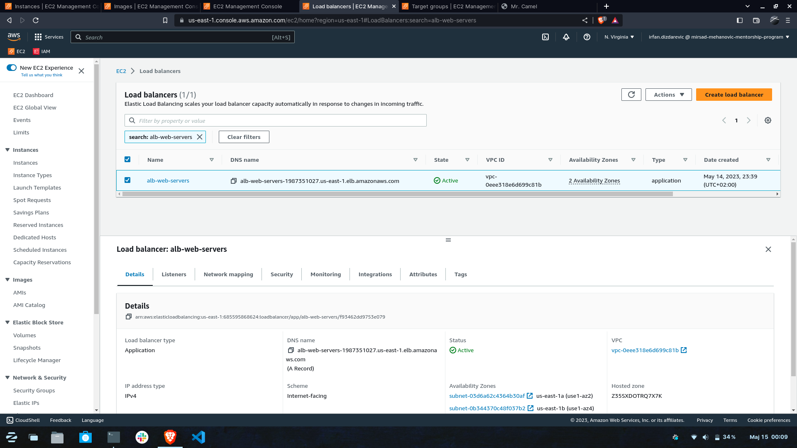
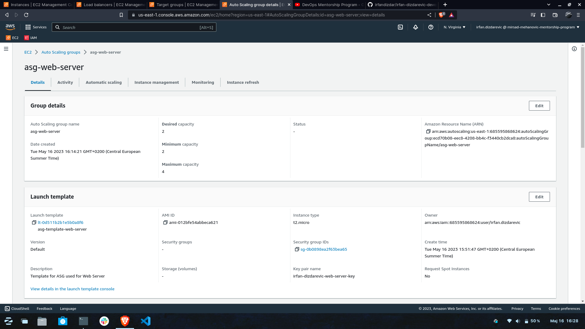

TASK 7:

AWS Account Owners / IAM User 1 azurirajte permsije za IAM 2 User-a na nacin da cete ga dodati u grupu Administrators
 Kreirajte AMI image od instance ec2-ime-prezime-web-server, AMI image nazovite ami-ime-prezime-web-server
 Kreirajte Application Load Balancer pod nazivom alb-web-servers koji ce da bude povezan sa Target Group tg-web-servers
 Kreirajte Auto Scaling group sa MIN 2 i MAX 4 instance. Tip instance koji cete koristiti unutar ASG je t2.micro ili t3.micro gdje cete koristiti alb-web-servers Load Balancer. AutoScaling group bi trebala da skalira prema gore (scale-up) kad god CPU predje 18% i da skalira prema dole (scale-down) kad god CPU Utilisation padne ispod 18%
 Voditite racuna da security grups koje budete koristili nakon sto zavrsite sa zadatakom dozvoljavaju namanje potrebne otvorene portove.
 Kreirajte free account na draw.io ili lucidchart.com stranicama i napravite dijagram infrastrukture iz ovog onako kako je vi vidite/razumijete.
 Pokusajte simulirati visoku dostupnost vase aplikacije na nacin da terminirate instance.
 Pokusajte simulirati CPU load 

1. Kreiran AMI Image od instance ec2-irfan-dizdarevic-web-server

2. Kreiran Application Load Balancer alb-web-server

3. ALB povezan sa Target group tg-web-server

4. ALB DNS RECORD

5. EC2 instance koje rade na ALB-u

6. Kreiran Auto Scalling Group Template

7. Kreiran Auto Scalling Group

8. ASG CPU Utilisation 18%

9. Instaliran Stress alat

10. Pokrenut Stress alat

11. Dijagram infrastrukture 

